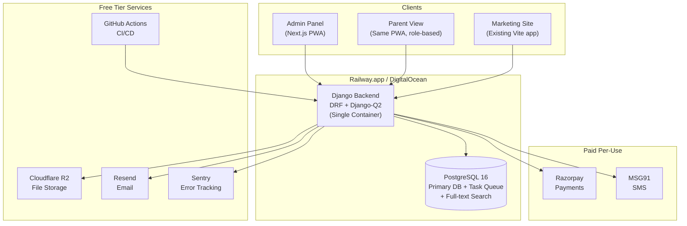

# ScoolERP — Lean MVP Plan & Budget-Optimized Stack

> **Document Version:** 1.1 — Lean Addendum  
> **Date:** March 25, 2026  
> **Reference:** [Full PRD v1.0](file:///Users/v.sgopthreya/.gemini/antigravity/Scool-ERP/ScoolERP_PRD.md)  
> **Purpose:** Define the minimal viable product, a cost-efficient tech stack, and realistic infrastructure costs for early-stage launch.

---

## 1. Why a Lean Plan?

The full PRD recommends **~$1,057/month** in infrastructure alone (AWS EKS, RDS Multi-AZ, ElastiCache, CloudFront, etc.). This is appropriate for 50+ school groups at scale, but **overkill for launch**.

For a product that hasn't onboarded its first paying customer yet, the priorities are:

1. **Ship fast** — Get into the hands of 3–5 pilot schools within 12 weeks
2. **Spend little** — Infrastructure should cost less than **$100/month** until revenue covers it
3. **Prove value** — Focus only on features that directly solve the #1 pain point: **fee collection**
4. **Scale later** — The full PRD becomes the graduation plan once product-market fit is validated

---

## 2. MVP Feature Scope — What to Build First

> [!IMPORTANT]
> **The 80/20 Rule:** 80% of revenue value comes from 2 modules — **Student Information** and **Fee Management**. Everything else can wait.

### ✅ MVP Modules (Build These)

| # | Module | MVP Features Only | Why It's Essential |
|---|---|---|---|
| 1 | **Authentication & RBAC** | Login, role-based access (Admin, Accountant, Teacher), multi-branch tenant setup | Nothing works without auth |
| 2 | **Student Information** | Registration form, student profiles, class/section assignment, bulk CSV import | Foundation for all other modules |
| 3 | **Fee Management** ⭐ | Fee structure config, invoice generation, Razorpay online payment, receipt PDF, defaulter list, SMS reminders | **The revenue engine** — this is what schools will pay for |
| 4 | **Communication** | Bulk SMS (via MSG91), email notifications (via Resend), in-app announcements | Parents need to be notified |
| 5 | **Basic Dashboard** | Student count, fee collection summary, branch-wise overview | Admins need visibility |

### ❌ Defer to Post-MVP (Do NOT Build Yet)

| Module | Reason to Defer |
|---|---|
| Transport Management | Complex (GPS, maps, hardware). Schools manage this manually for now |
| Staff & HR / Payroll | Low urgency for pilot. Schools already use separate payroll tools |
| Examination & Results | Only needed during exam season (2x/year). Can be added in 3 months |
| Inventory Management | Nice-to-have. Schools use spreadsheets until scale demands this |
| AI / ML Features | Zero training data exists. Needs 6+ months of data collection first |
| Mobile Apps (Native) | **Use a Progressive Web App (PWA) instead** — one codebase, no app store hassle |
| Advanced Analytics | Basic SQL dashboards are sufficient for 5 schools |
| Accounts & Finance | Schools have existing accountants + Tally. Integrate later, don't replace |

---

## 3. Lean Tech Stack

### The Guiding Principle

> **Use boring, proven, cheap technology. Maximize what one full-stack developer can maintain alone.**

### Backend

| Component | Lean Choice | Replaces (from Full PRD) | Why |
|---|---|---|---|
| **Language** | Python 3.12 | Same | No change — Python is ideal |
| **Framework** | Django 5 + DRF | Same | No change — Django is perfect for ERP |
| **Background Jobs** | Django-Q2 (single process) | Celery + Redis + broker | Celery needs a separate broker + worker. Django-Q2 runs inside the same process using the DB as broker. **Zero extra infra** |
| **WebSockets** | Not needed for MVP | Django Channels | Real-time features are Phase 2. Polling is fine for now |
| **API Style** | REST only | REST + GraphQL | GraphQL adds complexity. REST covers all MVP needs |

> [!TIP]
> **Django-Q2 vs Celery:** For an MVP with < 1,000 background tasks/day (fee reminders, receipt generation), Django-Q2 uses your existing PostgreSQL as the task broker. This eliminates the need for Redis entirely in Phase 1, saving ~$15-25/month.

### Frontend

| Component | Lean Choice | Replaces (from Full PRD) | Why |
|---|---|---|---|
| **Framework** | Next.js 15 (App Router) | Same | No change — handles both marketing site and admin panel |
| **Language** | TypeScript | Same | Non-negotiable for an ERP |
| **Styling** | Tailwind CSS 4 | Same | Already in use |
| **State** | TanStack Query only | Zustand + TanStack Query | Server state (TanStack Query) covers 95% of needs. No client store needed yet |
| **Tables** | TanStack Table | Same | Essential for student lists, fee records |
| **Charts** | Recharts | Same | Lightweight, well-documented |
| **Forms** | React Hook Form + Zod | Same | No change |

### Mobile Strategy — PWA, Not Native

| Aspect | Lean Choice | Replaces (from Full PRD) | Savings |
|---|---|---|---|
| **Parent App** | Progressive Web App (PWA) | React Native app | Eliminates 2 mobile engineers, no app store fees, no dual codebase |
| **Teacher App** | PWA (same codebase) | React Native app | Same Next.js app with role-based views |
| **Push Notifications** | Web Push API + Firebase | FCM via React Native | Works on Android. iOS web push supported since iOS 16.4 |
| **Offline Support** | Service Worker + IndexedDB | WatermelonDB | Basic offline for viewing student data. Full offline sync is Phase 2 |

> [!WARNING]
> **PWA Limitation:** iOS push notifications via PWA require the user to "Add to Home Screen". This is acceptable for a pilot but may need a native shell (Capacitor/Expo) for wider rollout. Budget for this in Phase 2.

### Database

| Component | Lean Choice | Replaces (from Full PRD) | Monthly Savings |
|---|---|---|---|
| **Primary DB** | PostgreSQL 16 (single instance, same VPS) | RDS Multi-AZ ($400) | **~$385** |
| **Caching** | PostgreSQL (unlogged tables) or in-memory (Django cache framework) | ElastiCache Redis ($150) | **~$150** |
| **Search** | PostgreSQL full-text search (`tsvector`) | Elasticsearch ($0 self-hosted but complex) | **Complexity saved** |
| **File Storage** | Cloudflare R2 (S3-compatible, free egress) | AWS S3 + CloudFront ($97) | **~$85** |

> [!NOTE]
> **PostgreSQL does everything for MVP.** Full-text search, JSON storage, background job queue (Django-Q2), caching (unlogged tables), and of course your primary data. Adding Redis/Elasticsearch is premature optimization for < 10 schools.

### DevOps & Infrastructure

| Component | Lean Choice | Replaces (from Full PRD) | Monthly Cost |
|---|---|---|---|
| **Hosting** | **Railway.app** or **DigitalOcean App Platform** | AWS EKS 3-node cluster ($350) | **$20–50** |
| **Database** | Railway managed PostgreSQL or DO Managed DB | RDS Multi-AZ ($400) | **$15–30** |
| **File Storage** | Cloudflare R2 | S3 + CloudFront | **$0–5** (10 GB free) |
| **CI/CD** | GitHub Actions | Same | **$0** (free tier) |
| **Monitoring** | Sentry free tier + Uptime Robot | Grafana + Prometheus + Loki ($50) | **$0** |
| **Email** | Resend (free tier: 3K/month) | AWS SES ($10) | **$0** |
| **DNS + SSL** | Cloudflare (free tier) | Route 53 + ACM | **$0** |
| **Error Tracking** | Sentry (free tier: 5K events/month) | Sentry (paid) | **$0** |

---

## 4. Cost Comparison — Full PRD vs Lean MVP

### Infrastructure Cost (Monthly)

| Service | Full PRD (AWS) | Lean MVP (Railway/DO) | Savings |
|---|---|---|---|
| Compute (App Server) | $350 (EKS 3-node) | $20 (Railway Pro) | **94%** |
| Database | $400 (RDS Multi-AZ) | $15 (Railway Postgres) | **96%** |
| Cache (Redis) | $150 (ElastiCache) | $0 (not needed) | **100%** |
| File Storage + CDN | $97 (S3 + CloudFront) | $0–5 (Cloudflare R2) | **95%** |
| Email | $10 (SES) | $0 (Resend free) | **100%** |
| Monitoring | $50 (Grafana Cloud) | $0 (Sentry free) | **100%** |
| DNS | $5 (Route 53) | $0 (Cloudflare free) | **100%** |
| **TOTAL** | **$1,057/month** | **$35–50/month** | **95% ↓** |

### Third-Party Service Costs (Monthly)

| Service | Provider | Free Tier | Estimated Cost |
|---|---|---|---|
| Payment Gateway | Razorpay | No monthly fee, 2% per txn | $0 (transaction fee only) |
| SMS (fee reminders) | MSG91 | 1,000 free SMS | $7–12 (for ~5K SMS) |
| Domain | Cloudflare Registrar | N/A | $10/year (~$1/month) |
| SSL Certificate | Cloudflare/Let's Encrypt | Free | $0 |
| **TOTAL** | | | **$8–13/month** |

### Grand Total Comparison

| | Full PRD | Lean MVP |
|---|---|---|
| **Monthly Infrastructure** | $1,057 | $35–50 |
| **Monthly Services** | ~$50 | $8–13 |
| **Monthly Total** | **~$1,107** | **~$47–63** |
| **Annual Total** | **~$13,284** | **~$564–756** |

> [!IMPORTANT]
> **The lean setup is 95% cheaper — approximately ₹4,000–5,000/month vs ₹92,000/month.** This is sustainable even before your first paying customer.

---

## 5. Lean Architecture Diagram

> **Key Insight:** The entire production backend is **one Django container + one PostgreSQL database**. That's it. No Redis, no Elasticsearch, no Kubernetes, no multi-node clusters. This is the power of a well-structured Django monolith.

---

## 6. Scaling Triggers — When to Graduate to the Full PRD

Don't pre-optimize. Upgrade components **only when specific pain points appear:**

| Trigger | What to Upgrade | Estimated When |
|---|---|---|
| API response > 500ms consistently | Add Redis cache ($15/month on Railway) | 20+ schools |
| Background job queue backing up | Migrate from Django-Q2 to Celery + Redis | 50+ schools |
| Student search feels slow | Add Meilisearch ($0 self-hosted or $30/month cloud) | 10,000+ students |
| File storage > 50 GB | Already on Cloudflare R2, just pay for usage | 30+ schools |
| Need native mobile push on iOS | Wrap PWA in Capacitor or Expo | When parent adoption requires it |
| Uptime SLA demanded contractually | Migrate to AWS RDS Multi-AZ + ECS | Enterprise contracts signed |
| Need real-time bus tracking | Add WebSocket support (Django Channels + Redis) | Transport module launch |
| Monthly revenue > ₹5L | Consider migrating to AWS for compliance/SLA | Product-market fit proven |

---

## 7. Lean Team Composition

| Role | Count | Responsibility | Full PRD Had |
|---|---|---|---|
| **Full-Stack Lead** (Django + Next.js) | 1 | Architecture, backend, code review | Tech Lead (1) |
| **Full-Stack Developer** | 1 | Frontend, API integration, PWA | FE (2) + Mobile (2) |
| **Backend Developer** | 1 | Business logic, integrations, payment | BE (3) |
| **Designer (Part-time / Freelance)** | 0.5 | UI/UX, Figma prototypes | Designer (1) |
| **Total** | **3.5** | | **13** |

> [!TIP]
> **Savings:** A lean team of 3.5 people vs 13 reduces monthly payroll by approximately **₹8–12 Lakhs** (assuming Indian market rates), which is far more significant than infrastructure costs.

---

## 8. Lean MVP Roadmap (16 Weeks)

### Phase 0 — Foundation (Weeks 1–3)

| Task | Details |
|---|---|
| Project setup | Django project, Next.js admin panel, CI/CD pipeline |
| Auth system | JWT login, RBAC (Admin, Teacher, Accountant), multi-branch tenant model |
| Database schema | Core models: Tenant, Branch, User, Student, ClassSection |
| Design system | Component library in Next.js (tables, forms, cards, modals) |

### Phase 1 — Student + Fee Core (Weeks 4–9)

| Task | Details |
|---|---|
| Student CRUD | Registration, profile view, class assignment, CSV bulk import |
| Fee structure | Create fee templates (tuition, transport, lab) per class/branch |
| Invoice engine | Auto-generate monthly invoices based on fee structure |
| Razorpay integration | Online payment with webhook reconciliation |
| Receipt generation | PDF receipt with school logo (using WeasyPrint) |
| Defaulter dashboard | List of unpaid invoices with aging (30/60/90 days) |

**🎯 Milestone:** Pilot school can register students and collect fees online.

### Phase 2 — Communication + Polish (Weeks 10–13)

| Task | Details |
|---|---|
| SMS integration | MSG91 for fee reminders (automated before due date) |
| Email notifications | Payment confirmation, receipt delivery via Resend |
| Announcement board | Admin posts visible to parents in PWA |
| Parent PWA view | Fee status, payment history, download receipts |
| Dashboard v1 | Student count, collection this month, pending dues chart |

**🎯 Milestone:** Parents can view and pay fees. Admins get a basic analytics view.

### Phase 3 — Hardening (Weeks 14–16)

| Task | Details |
|---|---|
| Multi-branch testing | Test data isolation between branches |
| Security audit | Input validation, SQL injection prevention, CSRF, XSS |
| Load testing | Simulate 200 concurrent users with k6 |
| Documentation | API docs (Swagger), admin user guide |
| Deployment | Production deploy on Railway/DO with custom domain + SSL |

**🎯 Milestone:** Production-ready MVP deployed. Ready for 3–5 pilot schools.

---

## 9. Post-MVP Prioritization (After Pilot Feedback)

Once the MVP is live and collecting feedback from pilot schools, prioritize the next features based on **what schools ask for most frequently**:

| Likely Priority | Module | Estimated Effort |
|---|---|---|
| 1st | Examination & Report Cards | 4–6 weeks |
| 2nd | Staff Attendance & Leave | 3–4 weeks |
| 3rd | Timetable Management | 3–4 weeks |
| 4th | Transport (basic, no GPS) | 4–5 weeks |
| 5th | WhatsApp Integration | 2 weeks |
| 6th | Native Mobile App Shell (Capacitor) | 2–3 weeks |

---

## 10. Summary — Full PRD vs Lean MVP

| Dimension | Full PRD | Lean MVP |
|---|---|---|
| **Modules** | 10 | 4 (Student, Fee, Communication, Dashboard) |
| **Infrastructure Cost** | ~₹92,000/month | ~₹4,000–5,000/month |
| **Team Size** | 13 people | 3.5 people |
| **Time to First Pilot** | 12 weeks | 9 weeks |
| **Mobile Strategy** | React Native (2 apps) | PWA (1 codebase) |
| **Database Services** | PostgreSQL + Redis + Elasticsearch | PostgreSQL only |
| **Hosting** | AWS EKS (Kubernetes) | Railway or DigitalOcean |
| **Complexity** | High (microservice-ready) | Low (monolith) |
| **Risk** | Over-engineering before PMF | Under-serving edge cases |

> [!CAUTION]
> **The lean plan is NOT a permanent architecture.** It is designed to last 6–12 months while you validate product-market fit. Once you have 20+ paying school groups and monthly revenue exceeds ₹5L, begin the migration to the enterprise-grade architecture described in the full PRD. The Django monolith and PostgreSQL foundation are designed to scale to that point without rewrites — you only add infrastructure around them.

---

*This lean plan should be read alongside the [full PRD](file:///Users/v.sgopthreya/.gemini/antigravity/Scool-ERP/ScoolERP_PRD.md). The full PRD remains the long-term target architecture.*
