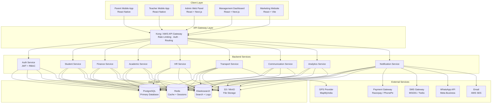
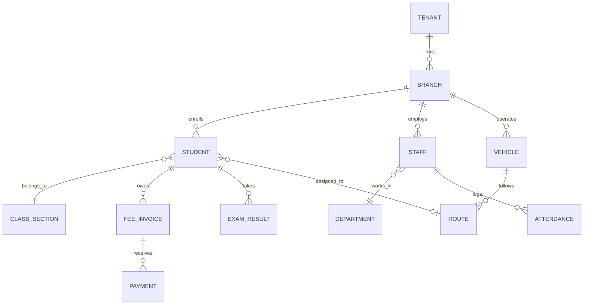

# ScoolERP — Product Requirements Document (PRD)

> **Document Version:** 1.0  
> **Date:** March 25, 2026  
> **Author:** Product & Engineering Team  
> **Status:** Draft — Pending Stakeholder Review  
> **Confidentiality:** Internal

---

## Table of Contents

1. [Executive Summary](#1-executive-summary)
2. [Product Vision & Positioning](#2-product-vision--positioning)
3. [Current State Analysis](#3-current-state-analysis)
4. [Target Users & Personas](#4-target-users--personas)
5. [Functional Requirements — Module Breakdown](#5-functional-requirements--module-breakdown)
6. [Non-Functional Requirements](#6-non-functional-requirements)
7. [System Architecture Overview](#7-system-architecture-overview)
8. [Recommended Technology Stack](#8-recommended-technology-stack)
9. [Third-Party Integrations](#9-third-party-integrations)
10. [Data Architecture & Schema Strategy](#10-data-architecture--schema-strategy)
11. [Security & Compliance](#11-security--compliance)
12. [Deployment & Infrastructure](#12-deployment--infrastructure)
13. [Phased Delivery Roadmap](#13-phased-delivery-roadmap)
14. [Success Metrics & KPIs](#14-success-metrics--kpis)
15. [Risks & Mitigations](#15-risks--mitigations)
16. [Appendix](#16-appendix)

---

## 1. Executive Summary

ScoolERP is a **multi-tenant, cloud-native School Enterprise Resource Planning** system designed for **groups of schools and educational trusts**. It centralizes academics, finance, human resources, transport, communication, and analytics into a single unified platform.

The product is positioned as:

> *"The Complete Digital Operating System for Modern Schools"*

This PRD outlines the full functional scope, recommended technology stack, architecture patterns, and phased delivery strategy to take ScoolERP from its current state (a marketing landing page) to a **production-grade SaaS product** capable of serving multi-branch school networks at scale.

---

## 2. Product Vision & Positioning

### Vision Statement
Empower school owners, administrators, and educational trusts with a single platform that replaces fragmented tools, eliminates manual processes, and provides real-time, data-driven control over every aspect of school operations.

### Core Value Pillars

| Pillar | Description |
|---|---|
| **Centralized Control** | One dashboard for all branches, departments, and stakeholders |
| **Revenue Optimization** | Automated fee lifecycle eliminating leakage and delinquency |
| **Operational Efficiency** | 80% reduction in manual administrative tasks |
| **Data-Driven Decisions** | Real-time analytics, forecasting, and AI-powered insights |

### Competitive Differentiation
- **Multi-school-first architecture** — Not a single-school product retrofitted for groups
- **Revenue intelligence** — Fee forecasting, defaulter prediction, and collection analytics
- **Unified ecosystem** — Dedicated interfaces for every stakeholder (Parent, Teacher, Admin, Management)
- **AI-ready infrastructure** — Built to support ML pipelines for student performance prediction, attrition forecasting, and smart automation

---

## 3. Current State Analysis

### What Exists Today

The project currently consists of a **React-based marketing landing page** built with the following stack:

| Layer | Technology | Version |
|---|---|---|
| Framework | React | 19.2.4 |
| Build Tool | Vite | 8.0.1 |
| Styling | Tailwind CSS | 4.2.2 |
| Icons | Lucide React | 1.6.0 |
| Routing | React Router DOM | 7.13.2 |

### Current File Structure

```
Scool-ERP/
├── src/
│   ├── components/
│   │   ├── layout/        → Navbar, Footer, Layout
│   │   └── sections/      → 10 landing page sections
│   ├── pages/
│   │   └── LandingPage.jsx
│   ├── App.jsx             → Router setup
│   ├── main.jsx            → Entry point
│   └── index.css           → Tailwind directives + design tokens
├── package.json
└── vite.config.js
```

### What Must Be Built

> [!IMPORTANT]
> The current codebase is exclusively a **static marketing website**. Zero backend logic, no database, no authentication, and no business logic exists. The entire application layer — backend API, database, mobile apps, and admin dashboards — must be designed and built from scratch.

---

## 4. Target Users & Personas

### Primary Personas

| Persona | Role | Needs | Platform |
|---|---|---|---|
| **Trust Owner** | Decision maker for group of schools | Financial overview, branch comparison, ROI visibility | Management Dashboard (Web) |
| **School Administrator** | Day-to-day operations manager | Student management, fee tracking, communication, reporting | Admin Panel (Web) |
| **Branch Principal** | Academic leader per branch | Academic oversight, exam management, teacher evaluation | Admin Panel (Web) |
| **Teacher** | Academic delivery | Attendance marking, grade entry, assignment management | Teacher App (Mobile) |
| **Parent** | Fee payer, student guardian | Fee payment, attendance view, communication, transport tracking | Parent App (Mobile) |
| **Accountant** | Financial operations | Ledger management, payment reconciliation, tax reports | Admin Panel (Web) |
| **HR Manager** | Staff administration | Payroll, leave management, recruitment tracking | Admin Panel (Web) |
| **Transport Manager** | Fleet operations | Route planning, driver assignment, live tracking | Admin Panel (Web) |

---

## 5. Functional Requirements — Module Breakdown

### Module 1: Student Information System (SIS)

| Feature | Priority | Description |
|---|---|---|
| Student Registration | P0 | Multi-step admission form with document upload |
| Student Profiles | P0 | 360° view — academic, financial, behavioral, medical |
| Class/Section Assignment | P0 | Drag-drop or bulk student allocation |
| Promotion/Migration | P1 | Year-end bulk promotion with conditional rules |
| Transfer Certificate | P1 | Auto-generated TC with digital signature |
| Alumni Tracking | P2 | Post-graduation tracking and engagement |

### Module 2: Fee Management ⭐ (Revenue-Critical)

| Feature | Priority | Description |
|---|---|---|
| Fee Structure Configuration | P0 | Branch-wise, class-wise, category-wise fee templates |
| Invoice Generation | P0 | Automated monthly/quarterly/annual invoicing |
| Online Payment Gateway | P0 | UPI, Credit/Debit, Net Banking, Wallets |
| Payment Reconciliation | P0 | Auto-match bank statements with invoices |
| Late Fee Automation | P0 | Configurable penalty rules with grace periods |
| SMS/WhatsApp Reminders | P0 | Multi-channel automated dunning sequences |
| Defaulter Dashboard | P0 | Real-time defaulter lists with aging analysis |
| Fee Concession & Scholarships | P1 | Rule-based discounts with approval workflows |
| Fee Forecasting (AI) | P2 | ML-based monthly collection predictions |
| Receipt Download/Print | P0 | PDF receipt generation with school branding |

### Module 3: Transport Management

| Feature | Priority | Description |
|---|---|---|
| Route Planning | P0 | Define routes, stops, and capacity |
| Vehicle & Driver Assignment | P0 | Fleet management with license/insurance tracking |
| Student-Route Mapping | P0 | Assign students to routes with pickup/drop times |
| Live GPS Tracking | P1 | Real-time bus location on parent app |
| Parent Proximity Alerts | P1 | Auto-notify when bus is N minutes away |
| Transport Fee Integration | P0 | Link transport fees to the fee module |

### Module 4: Staff & HR

| Feature | Priority | Description |
|---|---|---|
| Employee Profiles | P0 | Personal, qualification, employment history |
| Attendance (Biometric/App) | P0 | Multiple clock-in methods with geo-fencing |
| Leave Management | P0 | Apply, approve, track leave balances |
| Payroll Processing | P1 | Salary calculation, deductions, bank file generation |
| Performance Reviews | P2 | KPI-based evaluation cycles |
| Recruitment Pipeline | P2 | Job posting, applicant tracking, interview scheduling |

### Module 5: Academic Management

| Feature | Priority | Description |
|---|---|---|
| Timetable Generator | P0 | Constraint-based auto-scheduling |
| Syllabus Tracking | P0 | Subject-wise progress tracking |
| Assignment Management | P1 | Create, distribute, submit, grade assignments digitally |
| Lesson Plans | P1 | Teacher-submitted, admin-approved lesson planning |
| LMS Integration | P2 | Basic content delivery with video support |

### Module 6: Examination & Results

| Feature | Priority | Description |
|---|---|---|
| Exam Scheduling | P0 | Create exam timetables with room/invigilator allocation |
| Marks Entry | P0 | Teacher-wise, subject-wise grade input |
| Report Card Generation | P0 | Customizable templates with school branding |
| Grade Analysis | P1 | Subject/class/branch performance analytics |
| Rank Lists | P0 | Auto-generated merit lists |

### Module 7: Communication System

| Feature | Priority | Description |
|---|---|---|
| In-App Messaging | P0 | Admin-to-parent, teacher-to-parent communication |
| Bulk SMS Gateway | P0 | Attendance, fee, event notifications |
| WhatsApp Business API | P1 | Template-based automated messaging |
| Email Notifications | P0 | Transactional emails for receipts, reports |
| Announcement Board | P1 | School-wide or class-specific announcements |
| Parent-Teacher Chat | P2 | Moderated 1:1 messaging within the app |

### Module 8: Accounts & Finance

| Feature | Priority | Description |
|---|---|---|
| General Ledger | P0 | Double-entry bookkeeping |
| Expense Management | P0 | Category-wise expense recording with approval |
| Vendor/Supplier Management | P1 | Vendor database with payment tracking |
| Bank Reconciliation | P1 | Statement import and auto-matching |
| P&L / Balance Sheet | P1 | Standard financial report generation |
| Tax Reports (GST) | P1 | GST-compliant invoicing and filing support |

### Module 9: Inventory Management

| Feature | Priority | Description |
|---|---|---|
| Item Catalog | P1 | Uniforms, books, lab equipment, stationery |
| Stock In/Out | P1 | Purchase orders and issuance tracking |
| Low Stock Alerts | P1 | Configurable threshold-based notifications |
| Branch-wise Inventory | P1 | Separate stock tracking per location |

### Module 10: Analytics Dashboard

| Feature | Priority | Description |
|---|---|---|
| Executive Summary | P0 | KPIs — enrollment, revenue, attendance, satisfaction |
| Branch Comparison | P0 | Side-by-side metrics across all schools |
| Trend Analysis | P1 | YoY enrollment, revenue, and retention trends |
| Custom Report Builder | P2 | Drag-drop report creation for advanced users |
| AI Anomaly Detection | P2 | Alert on unusual patterns (attendance drops, fee spikes) |

---

## 6. Non-Functional Requirements

| Category | Requirement | Target |
|---|---|---|
| **Performance** | API response time (p95) | < 200ms |
| **Performance** | Dashboard load time | < 2 seconds |
| **Scalability** | Concurrent users per branch | 500+ |
| **Scalability** | Total supported branches | 100+ per tenant |
| **Availability** | Uptime SLA | 99.95% |
| **Data Residency** | Storage location | India (primary), configurable per region |
| **Accessibility** | WCAG compliance | Level AA |
| **Localization** | Language support | English, Hindi, regional languages (Phase 3) |
| **Offline Support** | Mobile apps | Core features available offline with sync |
| **Backup** | Recovery Point Objective (RPO) | 1 hour |
| **Backup** | Recovery Time Objective (RTO) | 4 hours |

---

## 7. System Architecture Overview

### High-Level Architecture



### Architecture Principles

1. **Multi-tenant with data isolation** — Each school group (tenant) gets logically isolated data using PostgreSQL Row-Level Security (RLS) or schema-per-tenant
2. **Modular monolith first, microservices later** — Start with a well-structured monolith and extract services as needed for independent scaling
3. **Event-driven communication** — Use message queues for async operations (notifications, report generation, analytics ingestion)
4. **API-first design** — All functionality exposed via REST/GraphQL APIs, enabling mobile and web clients to use the same backend

---

## 8. Recommended Technology Stack

### Backend

| Component | Recommended Technology | Rationale |
|---|---|---|
| **Language** | Python 3.12+ | Mature ecosystem, excellent for AI/ML integration, large talent pool in India |
| **Web Framework** | Django 5.x + Django REST Framework | Battle-tested ORM, built-in admin, excellent security defaults, massive community |
| **Async Tasks** | Celery + Redis | For background jobs: report generation, notifications, payment reconciliation |
| **API Style** | REST (primary) + GraphQL (analytics) | REST for CRUD-heavy modules; GraphQL for flexible dashboard queries |
| **WebSocket** | Django Channels | Real-time features: live bus tracking, chat, live notifications |

> [!TIP]
> **Why Django over Flask?**  
> Django's built-in ORM, admin panel, authentication system, and migration framework dramatically reduce development time for an ERP with 10+ interconnected modules. Flask would require assembling these individually, increasing maintenance overhead.

### Frontend — Web

| Component | Recommended Technology | Rationale |
|---|---|---|
| **Framework** | Next.js 15 (App Router) | SSR for SEO (marketing), RSC for dashboard performance, excellent DX |
| **Language** | TypeScript 5.x | Type safety critical for a complex ERP with shared data models |
| **Styling** | Tailwind CSS 4.x | Already in use, excellent utility-first approach for rapid UI dev |
| **State Management** | Zustand + TanStack Query | Zustand for client state, TanStack Query for server state/caching |
| **Data Tables** | TanStack Table | Complex tabular data with sorting, filtering, pagination, exports |
| **Charts** | Recharts or Tremor | Dashboard visualizations and analytics |
| **Forms** | React Hook Form + Zod | Performant forms with schema-based validation |
| **Rich Text** | TipTap | For announcements, lesson plans, assignment descriptions |

### Frontend — Mobile

| Component | Recommended Technology | Rationale |
|---|---|---|
| **Framework** | React Native 0.76+ (New Architecture) | Code sharing with web team, single language across stack |
| **Navigation** | React Navigation 7 | Industry standard for RN navigation |
| **State** | Zustand + TanStack Query | Consistent with web app |
| **Push Notifications** | Firebase Cloud Messaging (FCM) | Cross-platform push notification delivery |
| **Offline Storage** | WatermelonDB | High-performance offline-first database for mobile |
| **Maps/GPS** | React Native Maps + MapMyIndia SDK | For live bus tracking feature |

### Database

| Component | Recommended Technology | Rationale |
|---|---|---|
| **Primary DB** | PostgreSQL 16 | ACID compliance, JSON support, RLS for multi-tenancy, mature |
| **Caching** | Redis 7 | Session storage, API response caching, Celery broker |
| **Search** | Elasticsearch 8 or Meilisearch | Full-text search across students, staff, transactions |
| **File Storage** | AWS S3 / MinIO (self-hosted) | Document storage: report cards, photos, invoices |
| **Analytics DB** | ClickHouse (Phase 3) | Columnar OLAP database for high-volume analytics queries |

### DevOps & Infrastructure

| Component | Recommended Technology | Rationale |
|---|---|---|
| **Cloud Provider** | AWS (Primary) or Azure | AWS dominates Indian market; Azure if targeting govt schools |
| **Containerization** | Docker + Docker Compose | Consistent environments across dev/staging/prod |
| **Orchestration** | Kubernetes (EKS) or ECS Fargate | Auto-scaling, self-healing, rolling deployments |
| **CI/CD** | GitHub Actions | Integrated with source control, free for private repos |
| **Monitoring** | Grafana + Prometheus + Loki | Metrics, alerting, and centralized logging |
| **Error Tracking** | Sentry | Real-time error monitoring across all services |
| **CDN** | CloudFront | Static asset delivery and API edge caching |
| **DNS** | Route 53 | Managed DNS with health checks |

### AI/ML Stack (Phase 3)

| Component | Recommended Technology | Rationale |
|---|---|---|
| **ML Framework** | scikit-learn + XGBoost | Student performance prediction, fee forecasting |
| **Data Pipeline** | Apache Airflow | Scheduled data ingestion and model training |
| **Model Serving** | FastAPI microservice | Lightweight inference endpoint |
| **Feature Store** | Feast (optional) | Centralized feature management for ML models |

---

## 9. Third-Party Integrations

| Integration | Provider Options | Purpose | Priority |
|---|---|---|---|
| **Payment Gateway** | Razorpay, PhonePe PG, CCAvenue | Online fee collection | P0 |
| **SMS Gateway** | MSG91, Twilio, Kaleyra | Transactional SMS (OTP, reminders) | P0 |
| **WhatsApp Business** | Meta (Official API via Gupshup/Wati) | Fee reminders, attendance alerts | P1 |
| **Email Service** | AWS SES, SendGrid | Transactional and marketing emails | P0 |
| **GPS/Maps** | MapMyIndia (Mappls), Google Maps | Live bus tracking, geofencing | P1 |
| **Biometric Devices** | ZKTeco, eSSL | Staff attendance hardware integration | P1 |
| **Accounting Export** | Tally ERP, Zoho Books (API) | Financial data export for CAs | P2 |
| **Government Portals** | UDISE+, State education portals | Regulatory compliance reporting | P2 |

---

## 10. Data Architecture & Schema Strategy

### Multi-Tenancy Model

```
┌─────────────────────────────────────────────────────┐
│                    PostgreSQL                        │
│                                                     │
│  ┌──────────────┐  ┌──────────────┐  ┌───────────┐ │
│  │ Shared Schema│  │ Tenant A     │  │ Tenant B  │ │
│  │              │  │ (Trust ABC)  │  │ (Trust XY)│ │
│  │ • tenants    │  │              │  │           │ │
│  │ • plans      │  │ • students   │  │ • students│ │
│  │ • billing    │  │ • fees       │  │ • fees    │ │
│  │ • configs    │  │ • staff      │  │ • staff   │ │
│  │              │  │ • branches   │  │ • branches│ │
│  └──────────────┘  └──────────────┘  └───────────┘ │
│                                                     │
│  Row-Level Security (RLS) enforces tenant isolation │
└─────────────────────────────────────────────────────┘
```

> [!IMPORTANT]
> **Recommendation:** Use **schema-per-tenant** for data isolation. This provides stronger separation than RLS while being more manageable than database-per-tenant. Django's `django-tenants` package natively supports this pattern.

### Key Entity Relationships



---

## 11. Security & Compliance

### Authentication & Authorization

| Layer | Implementation |
|---|---|
| **Authentication** | JWT (access + refresh tokens) with secure httpOnly cookies |
| **MFA** | TOTP-based 2FA for admin and management roles |
| **Authorization** | Role-Based Access Control (RBAC) with granular permissions |
| **Session Management** | Redis-backed sessions with configurable TTL |
| **Password Policy** | Minimum 8 chars, complexity requirements, bcrypt hashing |

### Data Protection

| Measure | Implementation |
|---|---|
| **Encryption at Rest** | AES-256 (AWS KMS managed keys) |
| **Encryption in Transit** | TLS 1.3 everywhere |
| **PII Handling** | Field-level encryption for Aadhaar, bank details |
| **Data Masking** | Auto-mask sensitive fields in API responses based on role |
| **Audit Logging** | Immutable audit trail for all create/update/delete operations |
| **GDPR/DPDP Compliance** | Data export, right to erasure, consent management |

### Infrastructure Security

| Measure | Implementation |
|---|---|
| **WAF** | AWS WAF with OWASP Core Rule Set |
| **DDoS Protection** | AWS Shield Standard |
| **Secret Management** | AWS Secrets Manager or HashiCorp Vault |
| **Vulnerability Scanning** | Snyk (dependencies) + Trivy (containers) |
| **Penetration Testing** | Quarterly third-party pen testing |

---

## 12. Deployment & Infrastructure

### Environment Strategy

| Environment | Purpose | Infrastructure |
|---|---|---|
| **Local** | Developer machines | Docker Compose |
| **Dev** | Integration testing | Single ECS instance |
| **Staging** | Pre-production validation | Production-mirror (scaled down) |
| **Production** | Live traffic | EKS/ECS with auto-scaling |

### Estimated Infrastructure Cost (Production — 50 Schools)

| Service | Spec | Est. Monthly Cost (USD) |
|---|---|---|
| ECS/EKS Cluster | 3 nodes, c6g.xlarge | $350 |
| RDS PostgreSQL | db.r6g.xlarge, Multi-AZ | $400 |
| ElastiCache Redis | cache.r6g.large | $150 |
| S3 Storage | 500 GB | $12 |
| CloudFront CDN | 1 TB transfer | $85 |
| SES Email | 100K emails/month | $10 |
| Monitoring Stack | Grafana Cloud | $50 |
| **Total** | | **~$1,057/month** |

> [!NOTE]
> Costs scale linearly. For 200+ schools, expect $2,500–4,000/month. Self-hosted alternatives (Hetzner, DigitalOcean) can reduce costs by 40–60% at the expense of managed service convenience.

---

## 13. Phased Delivery Roadmap

### Phase 1 — Core Foundation (Weeks 1–12)

| Deliverable | Details |
|---|---|
| Authentication & RBAC | Login, roles, permissions, tenant setup |
| Student Information System | Registration, profiles, class assignment |
| Fee Management (Core) | Fee structure, invoicing, online payment, receipts |
| Admin Panel (Web) | Dashboard shell, student CRUD, fee tracking |
| Basic Communication | SMS notifications for fee reminders |

**Milestone:** First pilot school group onboarded.

### Phase 2 — Expansion (Weeks 13–24)

| Deliverable | Details |
|---|---|
| Staff & HR | Profiles, attendance, leave management |
| Academic Management | Timetable, syllabus tracking |
| Examination & Results | Exam scheduling, marks entry, report cards |
| Parent Mobile App (v1) | Fee payment, attendance view, notifications |
| Teacher Mobile App (v1) | Attendance marking, grade entry |
| Transport Management | Route planning, student mapping |

**Milestone:** Full academic cycle supported end-to-end.

### Phase 3 — Intelligence & Scale (Weeks 25–40)

| Deliverable | Details |
|---|---|
| Analytics Dashboard | Executive KPIs, branch comparison, trends |
| Live GPS Tracking | Real-time bus tracking on parent app |
| WhatsApp Integration | Automated message templates |
| Accounts & Finance | Ledger, expense tracking, P&L reports |
| AI Features (v1) | Fee forecasting, attendance anomaly detection |
| Inventory Management | Stock tracking across branches |

**Milestone:** Enterprise-ready product with AI capabilities.

---

## 14. Success Metrics & KPIs

### Product KPIs

| Metric | Target (Year 1) |
|---|---|
| School groups onboarded | 25+ |
| Total branches managed | 100+ |
| Monthly fee collection processed | ₹10 Cr+ |
| Parent app DAU (% of enrolled parents) | 40%+ |
| Teacher app DAU (% of staff) | 70%+ |
| Feature adoption rate (modules used per school) | 6+ of 10 |

### Technical KPIs

| Metric | Target |
|---|---|
| API uptime | 99.95% |
| API latency (p95) | < 200ms |
| Mobile app crash rate | < 0.5% |
| Deployment frequency | 2x per week |
| Mean Time to Recovery (MTTR) | < 30 minutes |
| Test coverage (backend) | > 80% |

---

## 15. Risks & Mitigations

| Risk | Severity | Likelihood | Mitigation |
|---|---|---|---|
| Slow school adoption due to change resistance | High | High | Dedicated onboarding team, WhatsApp-based training, free pilot period |
| Payment gateway failures during fee collection | High | Medium | Multi-gateway failover (Razorpay + PhonePe), webhook retry mechanism |
| Data migration from legacy systems | Medium | High | Build CSV/Excel import tools, dedicated data migration scripts per school |
| Scaling issues with multi-tenant DB | High | Medium | Schema-per-tenant isolation, connection pooling (PgBouncer), read replicas |
| Regulatory changes (NEP, state board rules) | Medium | Medium | Configurable academic structure, abstracted grading engine |
| Mobile app store rejection | Medium | Low | Follow Apple/Google guidelines strictly, beta testing via TestFlight/Internal Track |
| Key developer attrition | High | Medium | Thorough documentation, code reviews, knowledge sharing sessions |

---

## 16. Appendix

### Team Composition (Recommended)

| Role | Count | Responsibility |
|---|---|---|
| **Technical Lead / Architect** | 1 | Architecture decisions, code quality, tech strategy |
| **Backend Engineers (Django)** | 3 | API development, business logic, integrations |
| **Frontend Engineers (React/Next.js)** | 2 | Admin panel, management dashboard, marketing site |
| **Mobile Engineers (React Native)** | 2 | Parent app, Teacher app |
| **UI/UX Designer** | 1 | Design system, prototypes, user research |
| **QA Engineer** | 1 | Test automation, regression testing, load testing |
| **DevOps Engineer** | 1 | CI/CD, infrastructure, monitoring |
| **Product Manager** | 1 | Roadmap, stakeholder management, prioritization |
| **Data/ML Engineer** (Phase 3) | 1 | Analytics pipelines, AI model development |
| **Total** | **13** | |

### Glossary

| Term | Definition |
|---|---|
| **Tenant** | A school group or educational trust — the top-level entity |
| **Branch** | An individual school campus within a tenant |
| **SIS** | Student Information System |
| **RBAC** | Role-Based Access Control |
| **RLS** | Row-Level Security (PostgreSQL feature) |
| **DPDP** | Digital Personal Data Protection Act (India, 2023) |
| **UDISE+** | Unified District Information System for Education |
| **CTA** | Call to Action |
| **DAU** | Daily Active Users |

---

> [!CAUTION]
> This PRD is a living document. All timelines, cost estimates, and technology choices should be validated during a formal technical design review before development begins. The phased approach allows for iterative learning — scope for each phase should be refined based on pilot feedback.

---

*Prepared for internal review. Pending sign-off from Product, Engineering, and Business stakeholders.*
